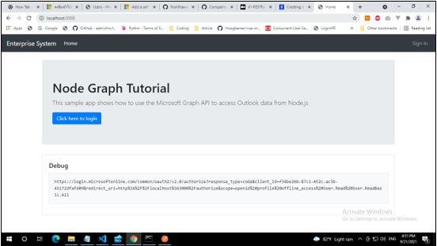
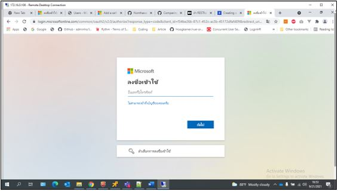
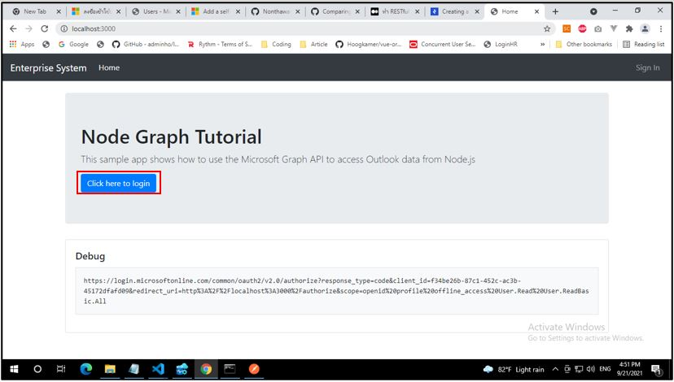
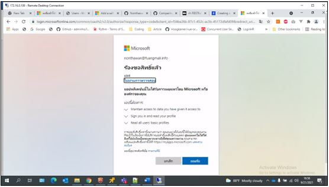
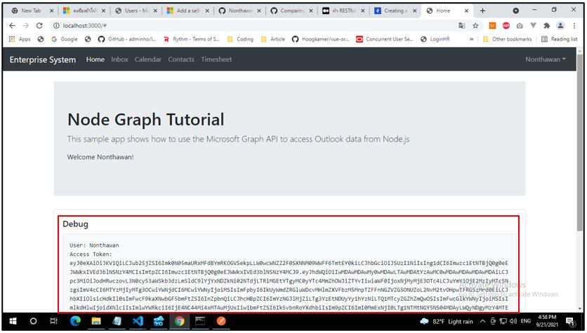

# node-tutorial
 วัตถุประสงค์ในการทำ: เพื่อแก้ไข bug ของ node เรื่องการให้สิทธิ์การเข้าถึงข้อมูล User
 
 # ขั้นตอนการ Node Authentication
 1. Git clone https://github.com/NanthawutTrainee/node-tutorial
 2. เปลี่ยน APP_ID และ APP_PASSWORD .ในไฟล์ env ให้เป็น Client id และ secret value ของ แอพลิเคชันที่ต้องแก้ไขสิทธิ์บัญชีผู้ใช้งาน

  <p align="center"></p>

 3. เปิด patch เข้าไปในโฟลเดอร์ของโปรแกรม ใน command line

  <p align="center"></p>
  
 4. ใช้คำสั่ง npm install . เพื่อติดตั้งแพ็คเกจที่ใช้ในการรันโปรแกรม
 
 ```sh
npm install .
```
<p align="center"></p>

5. ต่อมาใช้คำสั่ง npm start ในการรันโปรแกรม
 ```sh
npm install .
```
<p align="center"></p>

6. ไปที่ http://localhost:3000 โดยพิมพ์ที่ช่อง URL ของ web browser

<p align="center"></p>

7. ทำการเข้ารหัสที่ต้องการทำ Authentication 

<p align="center"></p>

8. คลิกปุ่ม Click here to login จากนั้นทำการเข้าสู่ระบบด้วยบัญชีที่ต้องการแก้ไขสิทธิ์

<p align="center"></p>

9. เมื่อเข้าสู่ระบบเสร็จจะแสดงหน้าต่างการร้องข้อสิทธิ์การเข้าถึงข้อมูล user ให้สามารถอ่านข้อมูลของผู้ใช้งานได้ จากนั้นกด ยอมรับ

<p align="center"></p>

เมื่อเสร็จแล้วจะขึ้นหน้าต่างดังรูปที่แสดง โดยระบบจะแสดงชื่อ User และ Access token ของบัญชีที่แก้ไข ถือว่าทำการแก้ไขสำเร็จ

<p align="center"></p>
